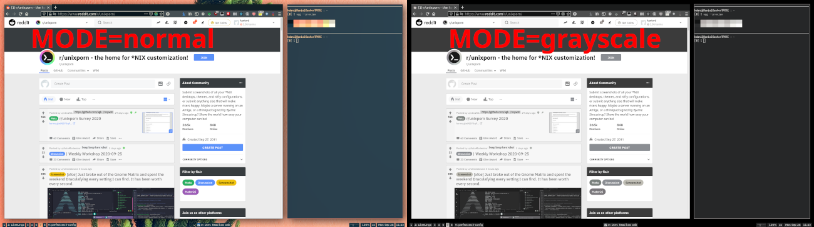

# compton-grayscale-reading-mode

This script implements a reading mode/grayscale mode in i3 window manager and other window managers using compton.

The level of desaturation is 95%, so there is still some color present, but it's desaturated to a very large degree.
This has no effect on your wallpaper: I recommend setting a black wallpaper using `hsetroot`.

In grayscale mode, backend is always `glx`.



## Usage

compton-grayscale-reading-mode is a wrapper around compton. _Any command line arguments are passed along to compton._

Any running compton instances are killed, therefore this script can be used to switch grayscale mode on and off.

Enable grayscale mode

```
MODE=grayscale compton.sh
```

Disable grayscale mode

```
MODE=normal compton.sh
```

